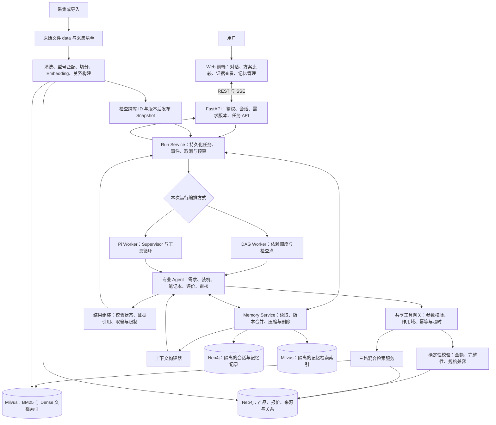
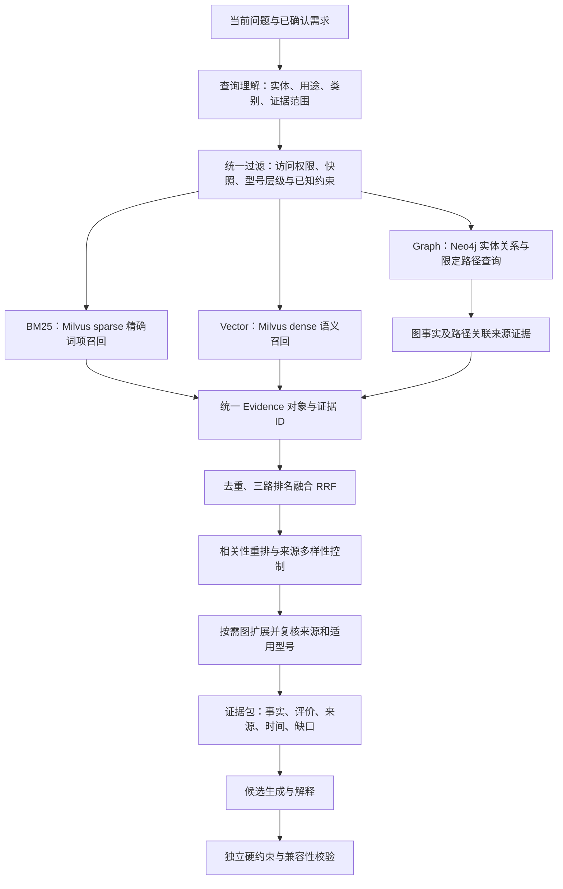
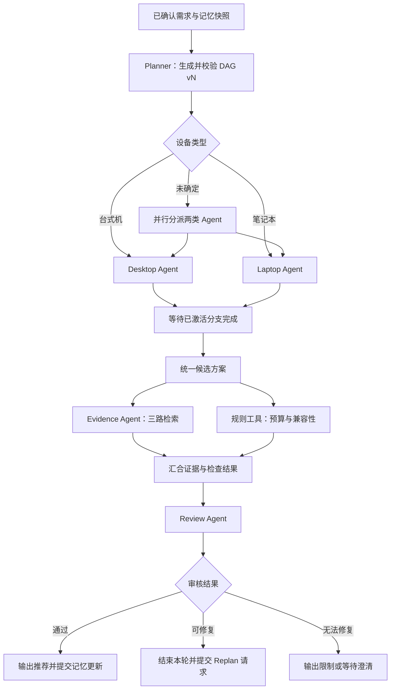
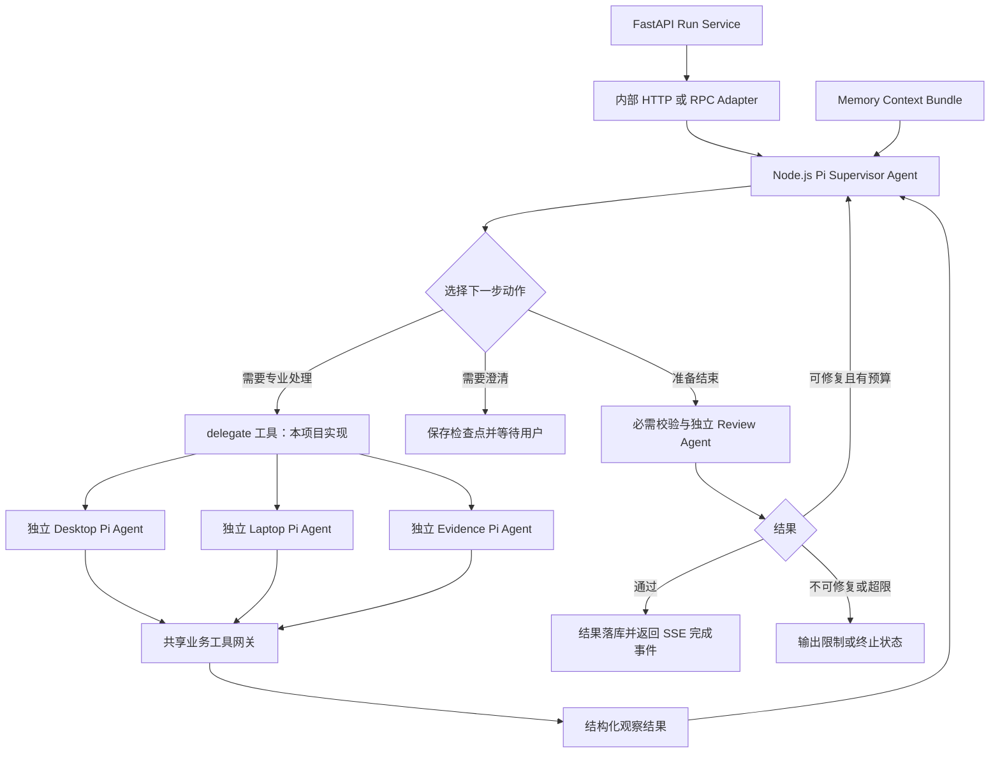
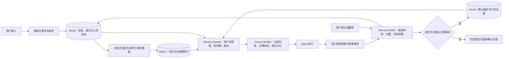

# BuildRig 系统架构设计

设计日期：2026-09-20。本文为拟实现方案，不代表当前仓库已完成这些功能。

## 1. 设计决策

- FastAPI 为统一业务入口；LangChain 用于 Python 侧检索、模型和工具适配。
- Neo4j 存储产品、具体配置、报价、规格、来源及关系；Milvus 存储文档片段的 dense 向量和 BM25 sparse 索引。
- RAG 使用 BM25、dense vector、Neo4j graph 三路召回，统一证据粒度后融合，另行执行硬约束校验。
- 提供两种可切换编排器：DAG 工作流执行器和 Pi Supervisor Runtime。同一运行仅选择一个顶层编排器，避免重复执行。
- Pi 指原 badlogic/pi-mono（当前指向 earendil-works/pi）的 Agent Core。使用 Node.js/TypeScript Worker，不把 Pi 当成 Python 库或默认启用 coding CLI 的 shell 工具。
- 原型使用 Neo4j 保存独立命名空间的会话、运行检查点和已确认记忆；Milvus 的 memory collection 仅作为派生检索索引。Redis 队列、租约及缓存是扩展选项，不是长期记忆的唯一存储。
- DAG 调度、Pi 多 Agent 委派、跨库一致性和记忆策略均需本项目实现或集成；不能仅通过引入 Agent Core 自动获得。

## 2. 系统总架构

图中的 Neo4j 和 Milvus 记忆节点是逻辑隔离的存储，不意味着必须另部署四套数据库。业务代码必须强制检查 user_id/session_id，不能只靠提示词隔离数据。若部署版本支持，也可进一步使用独立数据库或 collection 隔离。

所有运行记录 trace_id、run_id、requirements_version、plan_version、snapshot_id、模型及索引版本。前端只订阅经过筛选的进度与决策摘要，不接收未审核答案或内部推理文本。

## 3. 三路 RAG 检索

### 三路职责

| 路径 | 回答的问题 | 返回单位 |
|---|---|---|
| BM25 | 某个具体型号、DDR5、软件名称出现在何处 | 文档片段 |
| Dense | 哪些内容讨论噪声、便携性、工程软件体验等语义 | 文档片段 |
| Graph | 某产品属于哪个配置、哪个报价对应它、相关规格和来源如何连接 | 有来源的图事实、路径及对应片段 |

图检索必须作为真实第三路召回，不能只把 Neo4j 用作向量结果的展示补充。可在三路召回之前使用 Neo4j 做结构化筛选，但筛选结果和图证据召回是不同职责。

Graph 使用参数化 Cypher 模板、允许的关系类型及最大跳数，原型可从 1–2 跳开始。查询约束与证据层级必须同时保留，系列评论不能升级为具体 SKU 事实。没有来源的图关系只作为待核查信息，不能支撑确定结论。

### 融合单位与评分

先将三路结果映射到统一 Evidence：evidence_id、kind、product_id、chunk_id 或 fact_id、source_id、match_level、snapshot_id、时间字段及 route_ranks。同一来源的同一证据跨路径共享 evidence_id；不同事实即使来自同一页面也不强行合并。

RRF 原型采用等权：score(e) = Σ 1 / (k + rank_route(e))。未出现在某路的证据贡献为 0。k、各路 Top K、图跳数及最终上下文条数通过验证集选择，不能假定某组参数最优。图路径先按明确的实体匹配、关系相关性和来源质量产生稳定排序。原始 BM25 分数、余弦相似度与路径分数不能直接相加。

应用层负责三路融合：Milvus 的内部融合只覆盖其自身召回路径，不能自动融合 Neo4j 返回的数据。可选 Cross Encoder 对统一证据文本重排；未选定模型时保留为扩展项。

预算、币种、锁定组件、型号匹配与快照要求不能被高相关性分数覆盖。缺失关键字段必须为 unknown，而非 passed。没有候选时返回数据缺口或请求调整约束，不能放宽预算后装作满足原要求。

### 入库与更新

原始文件 → 清洗和 SKU 识别 → 产品/报价/来源图 + 文档切分 → dense embedding + BM25 sparse 索引 → 校验主键、引用、数量和版本 → 发布共同 snapshot_id。所有记录以 snapshot_id 区分新旧；在发布前必须确认目标读一致性级别下可查询。失败批次不发布，支持幂等重试。Neo4j 中的发布清单控制可读快照，不能假设 Neo4j 和 Milvus 有跨库 ACID 事务。活动运行固定快照；旧快照在无运行引用并超过保留期后回收。

## 4. 方案 A：DAG 多 Agent 编排

这张图只表示一轮有向无环执行。外层 Run Controller 接收 Replan 请求，检查轮数、时间和成本预算后创建 DAG vN+1，不向旧 DAG 加回边。用户澄清和需求变更也由外层控制器建立新版本。所有新 DAG 必须检查无环、工具允许列表和输入输出契约。

任务记录 task_id、agent_role、depends_on、input_refs、output_schema、timeout、retry_policy、status 和 idempotency_key。状态包含 pending/running/succeeded/failed/skipped/cancelled。未激活分支为 skipped，汇合只等待实际分派的分支；失败和部分成功必须显式处理。

每个任务完成后保存输入版本、工具产物和检查点。任务重试复用幂等键；新规划产生新 task_id。只在需求、产品集合、快照、规则版本等依赖未变时复用旧结果。多个 Agent 只返回结构化产物，由编排器统一合并共享状态。

## 5. 方案 B：Pi Runtime 多 Agent 编排

Pi Agent Core 提供工具执行、事件和状态机制；本项目通过多个独立 Agent 实例及自定义 delegate 工具实现多 Agent。委派工具、业务权限、持久化检查点、预算控制和审核门禁属于应用设计，不宣称 Pi 默认自动提供整套业务能力。

Supervisor 维护显式 plan_version、任务账本和完成条件。专业 Agent 只获得完成任务需要的上下文和工具。允许独立只读任务并行；写记忆、发布结果和需求版本变更由单一服务串行提交。

工具集合建议为 query_products、retrieve_hybrid、compose_build、validate_option、delegate_desktop、delegate_laptop、delegate_evidence、request_clarification、propose_memory_update、submit_result。submit_result 由服务器强制验证检查结果和证据引用，不能仅因模型决定结束就跳过审核。

Pi Worker 通过受服务身份保护的内部接口访问 Python LangChain 检索工具，既保留 FastAPI/LangChain 后端，又避免重复实现两套检索逻辑。接口使用版本化 JSON Schema；SSE 由 FastAPI 将 Pi 事件转为统一业务事件。运行取消信号同时传播到模型、子 Agent 和工具；持久化步骤有幂等与恢复策略，不能把一次 agent_end 事件等同于所有业务任务已经成功。

## 6. 两种编排的关系

| 维度 | DAG | Pi Runtime |
|---|---|---|
| 控制方式 | 明确依赖顺序，调度器决定何时执行 | Supervisor 根据工具观察选择下一步 |
| 计划表示 | 可校验的 DAG 与版本 | 结构化任务账本与动态动作 |
| 多 Agent | 图中的任务节点 | 独立实例及自定义委派工具 |
| 重规划 | 外层创建下一版 DAG | 受限循环更新计划 |
| 恢复 | 任务级检查点与依赖重放 | 会话检查点、工具调用账本与业务状态对账 |
| 适用 | 固定装机流程、验收和稳定基线 | 澄清较多、路径不固定的探索任务 |

第一版提供 orchestration_mode=dag|pi 两种可比较模式。后续可把 Pi 专业 Agent 作为 DAG 节点内部运行时，但这是嵌套部署方式，不是同一请求启动两套顶层调度器。对比实验固定模型、工具、数据快照、记忆初态及成本/调用上限。

## 7. 记忆架构

| 层次 | 内容 | 存储与读取规则 |
|---|---|---|
| 工作记忆 | 本次约束、锁定组件、计划、候选 ID、校验结果、工具产物引用 | Neo4j RunState/Task；热缓存可选；检查点可恢复 |
| 会话记忆 | 原始消息、澄清答案、当前需求、历史方案 | Neo4j Session/Message/RequirementVersion；按时间和版本读取 |
| 用户长期记忆 | 用户明确确认的偏好、已有设备、地区 | Neo4j UserPreference/OwnedDevice；不得从一次推荐推断购买事实 |
| 情景记忆 | 过去选择或拒绝方案的原因、会话摘要 | 原记录在 Neo4j，摘要向量在独立 Milvus collection；检索后回源验证 |
| 程序性知识 | 预算算法、兼容规则、提示模板、工具权限 | Git 版本化代码/配置，不允许 Agent 自行将聊天改写为规则 |
| 领域知识 | 产品规格、价格、评论、来源图 | 产品 Neo4j 图及 Milvus corpus；属于 RAG 知识库，不是个人记忆 |

每条长期记忆至少保存 memory_id、user_id、type、value、source_message_id、confirmation_status、created_at、updated_at、valid_until、version；摘要另外保存 covered_message_ids。工具失败、当前报价和库存不是长期用户偏好。

优先级：当前已确认需求 > 本会话明确历史 > 仍有效的长期偏好 > 推断或摘要。硬约束只从结构化记录注入，不能被摘要压缩丢失。若用户明确说“这次不要独显”，不得被历史“喜欢游戏显卡”覆盖。存在歧义时澄清，不静默合并。

读取先做用户和会话过滤，再做语义检索；向量命中必须回源检查版本、删除标记和有效期，不能从全体用户记忆中检索后才在提示词里要求隔离。写入由 Memory Service 使用预期版本检查，Agent 只提交提案，不并发覆盖用户状态。

只在开启长期记忆且用户明确表达或确认时持久化个人偏好。用户可查看、更正、删除及关闭长期记忆。删除先在权威记录标记不可读，再清理 Milvus 派生索引、缓存和摘要，完成后返回处理状态。关闭长期记忆不等于不能保留当前会话；保留期应在产品中明确并可配置。

压缩保留近几轮原始消息及带消息引用的旧会话摘要；锁定组件、预算和未知事项独立保留。Checkpoint 用于恢复执行，聊天摘要用于减少上下文，二者不能互相代替。

## 8. 接口契约与运行状态

| 接口 | 作用 |
|---|---|
| POST /api/v1/sessions | 创建会话与记忆设置 |
| POST /api/v1/sessions/{id}/messages | 提取或更新需求，保留版本冲突检测 |
| POST /api/v1/sessions/{id}/runs | 指定 requirements_version、orchestration_mode，创建运行 |
| GET /api/v1/runs/{id}/events | SSE：阶段、澄清、审核、完成和错误 |
| GET /api/v1/runs/{id}/result | 方案、证据、价格、检查项、限制 |
| POST /api/v1/runs/{id}/cancel | 取消执行并传播至工具 |
| GET /api/v1/me/memories | 查看当前用户记忆 |
| PATCH /api/v1/me/memories/{id} | 版本化更正或确认偏好 |
| DELETE /api/v1/me/memories/{id} | 删除权威记忆并清理派生记录 |
| POST /internal/v1/retrieval/hybrid | Pi 调用 Python 三路检索服务 |
| POST /internal/v1/options/validate | 执行预算与兼容规则 |

内部接口仅供服务身份调用，并继承 run_id 的用户作用域；不能信任调用参数中任意填写的 user_id。DAG 可直接调用同样的 Python 服务函数，Pi 通过适配层调用，保证同一业务语义。

运行统一记录 user_id、session_id、run_id、requirements_version、plan_version、snapshot_id、orchestration_mode、memory_version、task_outputs、evidence_ids、validation_results、revision_count、time/token/tool budgets 和 event_sequence。状态为 queued/running/waiting_for_user/completed/failed/cancelled；无可行方案属于 completed 的业务结果，而非服务异常。

## 9. 验收与实验

- 三路 RAG：比较 dense-only、BM25+dense、BM25+dense+graph，使用同样标注查询、快照及输出证据预算；测 Recall@k、nDCG@k、来源准确性、型号误配率和延迟。
- 编排：比较 DAG 与 Pi 的硬约束满足率、任务完成率、调用数、成本、延迟和恢复成功率；不能通过给某方案更多预算得出优势。
- 记忆：测试改预算、保留组件、矛盾偏好、摘要遗漏、匿名用户、用户隔离、过期记忆、删除后检索及 Worker 崩溃恢复。
- 失败：测试任一路召回超时、无候选、跨库版本不一致、未知 BIOS、库存陈旧与重复工具调用。可降级时在结果标明实际检索路径，不能把缺失检查标为通过。
- 所有输出价格来自结构化报价；每条确定性推荐理由可追溯到规格事实或显式需求；主观评价以评价形式表达。

## 10. 官方参考

- Pi 项目及 Agent Core：https://github.com/earendil-works/pi 和 https://github.com/earendil-works/pi/tree/main/packages/agent 。Agent Core 的工具执行、事件及上下文变换用于支撑本设计；多 Agent 业务委派是本项目实现。
- Milvus 混合召回：https://milvus.io/docs/multi-vector-search.md 。BM25 sparse 与 dense 可以由同一 Milvus 服务承载。
- Milvus 排名融合：https://milvus.io/docs/reranking.md 。本设计另外在应用层融合 Neo4j 图证据。
- Neo4j 图检索模式：https://neo4j.com/docs/neo4j-graphrag-python/current/api.html 。用于参考来源关联和图遍历模式，不假设其内置 Retriever 自动跨库连接 Milvus。
